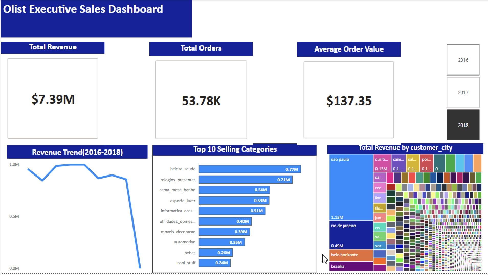
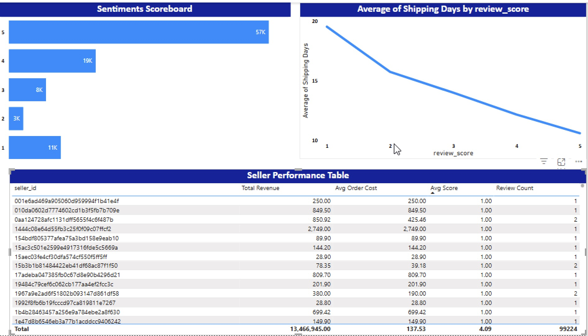
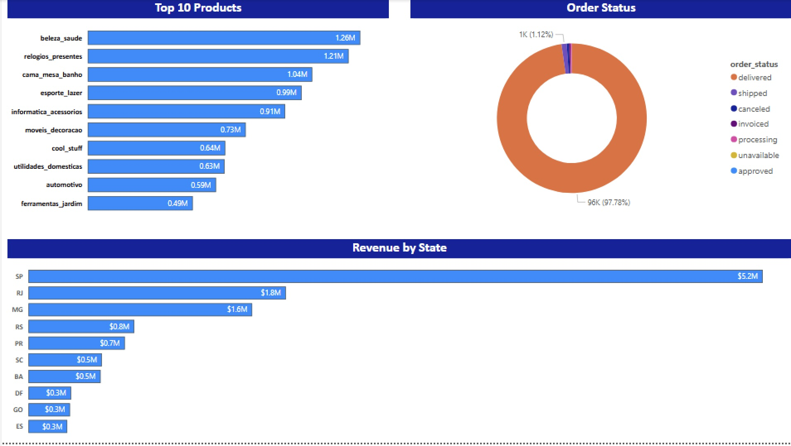

# 🛒 Olist E-Commerce: End-to-End Data Pipeline & BI Solution

   

## 📋 Executive Summary

This project is an end-to-end business intelligence solution designed to analyze the Olist E-Commerce dataset (100k+ orders). It moves beyond static analysis by implementing a **production-grade Client-Server architecture**.

**Business Goal:** Identify the correlation between logistics performance (shipping days) and customer satisfaction (review scores).
**Result:** Identified that a delivery delay of >3 days results in a 2-point drop in average review score.

## 🏗 Architecture

The system follows a classic ELT (Extract, Load, Transform) pattern hosted on a hybrid infrastructure:

`Raw Data (CSV)` ➡️ **`Python ETL (Pandas/SQLAlchemy)`** ➡️ **`PostgreSQL (Linux Server)`** ➡️ **`SQL Transformation (Star Schema)`** ➡️ **`Power BI (Dashboard)`**

## 🔧 Technical Implementation

### 1. Infrastructure (Linux & Postgres)

- Provisioned a **PostgreSQL** instance on a remote **Ubuntu** server.
- Configured `pg_hba.conf` and `postgresql.conf` to allow secure remote connections from the analytics workstation.
- Managed database services using `systemctl`.

### 2. Automated Ingestion (Python)

Developed a custom Python script (`etl_pipeline.py`) to automate data loading:

- **Extraction:** Reads raw CSV files using `pandas`.
- **Validation:** standardized date formats and schema checks.
- **Loading:** Uses `sqlalchemy` engine to push records to the remote server in batches.

### 3. Data Modeling (SQL)

Transformed raw 3NF (Third Normal Form) data into a **Star Schema** optimized for BI reporting:

- **Fact Table:** `gold.fact_sales` (Granularity: One row per order item).
- **Dimensions:** `dim_customers`, `dim_products`, `dim_sellers`.
- **Challenge Solved:** The dataset had mismatched `customer_id` (session) vs `customer_unique_id` (profile). Wrote a custom SQL View to bridge these keys, ensuring accurate customer segmentation.

### 4. Visualization (Power BI)

- **DAX Measures:** Calculated `Average Delivery Days`, `Revenue per State`, and `Churn Risk`.
- **Drill-Downs:** Enabled hierarchy drilling from _Year_ -> _Quarter_ -> _Month_.

## 📸 Dashboard Screenshots

### 1. Executive Summary

### 1. Executive Summary

_High-level KPIs tracking revenue, delivery performance, and active user trends._

### 2. Seller Performance Analysis

_Operational view identifying underperforming sellers based on shipping delays and review scores._

### 3. Product & Customer Insights

_Deep dive into product categories and customer geolocation clusters._

### 1. Executive Summary

_High-level KPIs tracking revenue, delivery performance, and active user trends._

### 2. Seller Performance Analysis

_Operational view identifying underperforming sellers based on shipping delays and review scores._

### 3. Product & Customer Insights

_Deep dive into product categories and customer geolocation clusters._

## 🚀 How to Run

1. Clone the repo.
2. Update database credentials in `etl_pipeline.py`.
3. Run `pip install -r requirements.txt`.
4. Execute `python etl_pipeline.py`.
