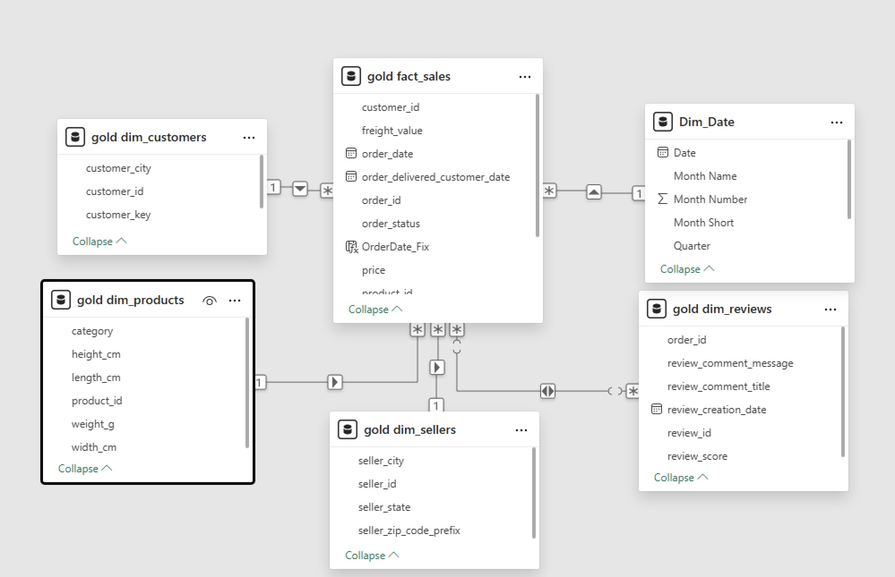

# 🛒 Olist E-Commerce: End-to-End Data Pipeline & BI Solution

  ![PowerBI][def] 

## 📋 Executive Summary

This project is an end-to-end **business intelligence and analytics engineering solution** built on the Olist E-Commerce dataset (100k+ orders). It demonstrates how raw transactional data can be transformed into **analytics-ready tables** to support **reliable Power BI reporting**, including delivery performance, customer satisfaction, and operational KPIs.

The solution is implemented using a **client–server architecture**, combining Python-based ingestion, PostgreSQL on Linux, SQL-based transformations, and a dimensional data model optimized for BI consumption.

### Business Goal

Identify the relationship between logistics performance (shipping days) and customer satisfaction (review scores).

### Key Result

Analysis showed that delivery delays of more than **three days** are associated with an approximate **2-point drop in average customer review score**.

## 🏗 Architecture

The system follows a classic ELT (Extract, Load, Transform) pattern hosted on a hybrid infrastructure:

`Raw Data (CSV)` ➡️ **`Python ETL (Pandas/SQLAlchemy)`** ➡️ **`PostgreSQL (Linux Server)`** ➡️ **`SQL Transformation (Star Schema)`** ➡️ **`Power BI (Dashboard)`**

## 🔧 Technical Implementation

### 1. Infrastructure (Linux & Postgres)

- Provisioned a **PostgreSQL** instance on a remote **Ubuntu** server.
- Configured `pg_hba.conf` and `postgresql.conf` to allow secure remote connections from the analytics workstation.
- Managed database services using `systemctl`.

### 2. Automated Ingestion (Python)

Developed a custom Python script (`etl_pipeline.py`) to automate data loading:

- **Extraction:** Reads raw CSV files using `pandas`.
- **Validation:** standardized date formats and schema checks.
- **Loading:** Uses `sqlalchemy` engine to push records to the remote server in batches.

### 3. Data Transformation (The Medallion Architecture)

I implemented a multi-layer transformation strategy to convert raw logs into a high-performance Star Schema. **DBeaver** served as the SQL development environment for profiling and testing logic.

- **🥉 Bronze Layer (Raw Ingestion):**

  - **State:** 9 separate CSV files (100k+ orders) in raw 3NF format.
  - **Action:** Python script ingested data "as-is" into PostgreSQL.
  - **Challenge:** Dates were non-standard strings, and customer IDs were fragmented.

- **🥈 Silver Layer (Cleaning & Logic):**

  - **State:** Cleaned, deduplicated tables.
  - **Action:** Used **DBeaver** to write SQL Views that handled NULLs, cast timestamps to `ISO 8601`, and resolved the `customer_id` vs. `customer_unique_id` mismatch.

- **🥇 Gold Layer (Star Schema):**
  - **State:** Production-ready Dimensional Model.
  - **Action:** Modeled data into a central Fact Table (`fact_sales`) surrounded by Dimensions (`dim_customers`, `dim_products`) optimized for Power BI performance.

**The Final Gold Data Model (ERD):**

### 4. Visualization (Power BI)

- **DAX Measures:** Calculated `Average Delivery Days`, `Revenue per State`, and `Churn Risk`.
- **Drill-Downs:** Enabled hierarchy drilling from _Year_ -> _Quarter_ -> _Month_.

## 📸 Dashboard Screenshots

### 1. Executive Summary

_High-level KPIs tracking revenue, delivery performance, and active user trends._

### 2. Seller Performance Analysis

_Operational view identifying underperforming sellers based on shipping delays and review scores._

### 3. Product & Customer Insights

_Deep dive into product categories and customer geolocation clusters._

## 🚀 How to Run

> **Scope note:**  
> This project focuses on data modeling and analytics enablement for Power BI reporting.  
> A follow-up project will demonstrate fully externalized configuration, containerization, and one-command reproducibility.

[def]: https://img.shields.io/badge/PowerBI-Desktop-yellow
